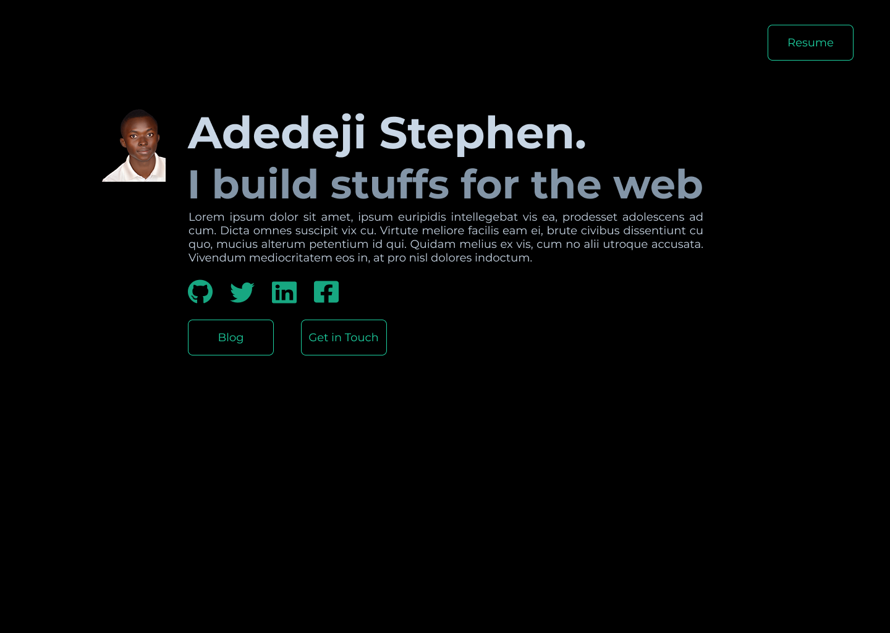

Like every other things we do in Life, it all started with a Plan &mdash; I began with planning the Technology stack I will make use of. And the awesome Techs we have out there today did not make that choice easy for me. At a time, I just thought of using **Node.js/Express** but I'd still be needing a portal to update my website &mdash; and all I wanted was something simple, something really simple that won't cost me a lot of time, and would be very easy for me to make updates.

**Okay**! I know what I want, the *"what do I use"* question is still there unanswered. Then I recall seeing *JAMstack* from one of [Sarah Drasner](https://twitter.com/sarah_edo)'s tweet &mdash; well, might be the time to check it out, and I did. Turned out that **JAMstack** is simply a new way of building websites and apps, and I had already used it &mdash; *Jekyll*.
I couldn't decide on what to use, so I just gave up on building it entirely. To be explicit about my requirements, I want something that:
* Requires no database
* I would be able to publish posts with Markdowns
* My Markdown will be nicely formatted, *like that of Github* 😎
* I won't have to think about the Server (I need a break)
* Would be Search Engine Optimized
* **Will not cost me too much of time**.

---
## Gatsby to the Rescue!
> Gatsby is a free and open source framework based on React that helps developers build blazing fast **websites** and **apps**.

I peeked on [Gatsby](https://www.gatsbyjs.org/) because I'd seen [Dan Abramov](https://twitter.com/dan_abramov)'s [Blog](https://overreacted.io) make use of it, and I was excited about the simplicity. But, uh-oh &mdash; Gatsby uses **GraphQL**, which I really don't know. The idea of having to pick up GraphQL now isn't something I can do with, that was what I told myself. I was going to give up &mdash;again, then it occurred to me what an "open source advocate" Dan is. *"He must definitely have [overreacted.io](https://overreacted.io) on his github* &mdash; that I said to myself. So I head over to [his Github](https://github.com/gaearon) and I did found the Blog [repository](https://github.com/gaearon/overreacted.io). I went over it, I saw he was using Markdowns to write his blog posts (remember it is on my requirement list), and it was clear to me at that point that Gatsby is what I needed! Now the *"what to use"* question is answered.
  
Two weeks passed that I made a decision to use Gatsby, I hadn't got the time to really work on this or walk through Gatsby at all. So, Six days ago (22/07), I spent my leisure time to read some of Gatsby Docs, and I followed their [Tutorials](https://www.gatsbyjs.org/tutorial/), which I find incredibly helpful. Really, Gatsby has nice Documentation and easy to follow tutorials. In 4 hours of hacking, I created a blog with their [tutorial](https://www.gatsbyjs.org/tutorial/). *I didn't even have to know GraphQL*, I picked up the ones I needed along the way.
 
Three days ago (25/07), I created this repository, extending the Gatsby *hello world* app. Creating a repository is the only way I'd make sure to complete this sooner. Then, I ran into another problem &mdash; Design!

---
## But I had Good Designs in my Head
I just couldn't actualize them. I bet there are some other developers out there who sucks at Design &mdash; not that we suck at it, we can't just produce really good UIs we have in our head, and if we try to do, we end up disgracing ourselves. 😂
 
As usual, I typed *figma.com* in my browser as I was mentally singing to myself how awesome this Design is going to be &mdash; sadly, I ended up with this.

 
*Oh my God! What is this? But I thought I had the Design figured out.* My next thought was to bail on it, postpone it to some other day. But I didn't, I just wanted to get it done, no matter what. I eventually took my shitty design to VS code for the implementation. And line by line, the pieces were all coming together. It all felt so static and dull, and just like a complete nonsense at first (*I'm not sure if it still doesn't feel like it*) &mdash; then I threw in some animations, at least, it's less "nonsense" that way. Here are what I make use of:
* Gatsby (*of course*)
* [Typography.js](https://kyleamathews.github.io/typography.js/) for site typography (I uses de-Young theme)
* Styling with SCSS
* [React Icons](https://react-icons.netlify.com/)
* Animation with [Animejs](https://animejs.com/)
* React Helmet to improve SEO

---
## TL;DR
**[Gatsby](https://gatsbyjs.org)** is super cool, and it could be the solution for your next project. 😎
Meanwhile, if you are a Junior developer like myself, and you feel like quitting a project because you don't feel like it make enough sense (or that you are not good enough) &mdash; just do it. It doesn't have to make *all the sense at first*, I mean, this doesn't, I still have a **lot more** improvement to do to this. What matters is that you are doing something that you weren't doing yesterday. In creativity, **quantity leads to quality** &mdash; just keep building and some day, you will build the next awesome thing people love!
 

The source code is on my [Github](https://github.com/ionware/adedejistephen.com)